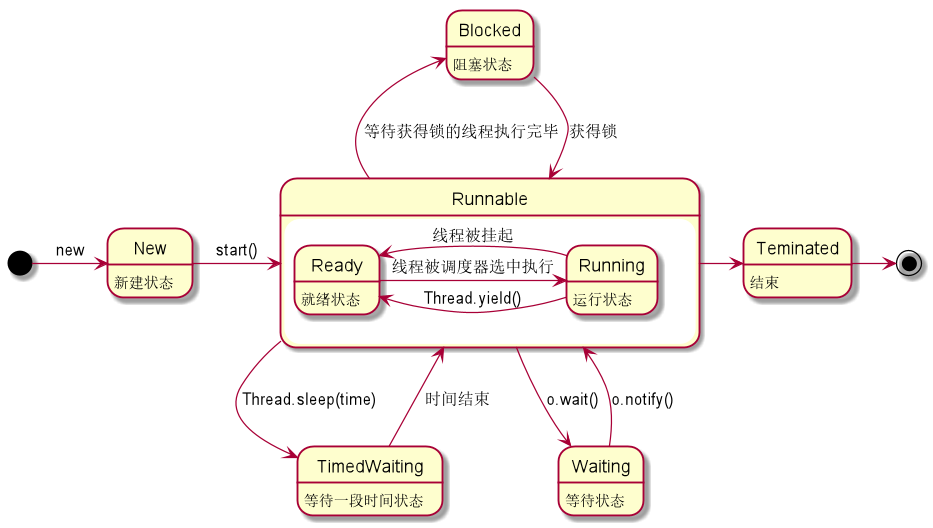

# 线程基础知识

## 基本概念
线程：一个程序里不同的执行路径

## 线程的创建方式
>创建线程的方式:     
1.继承 Thread 类    
2.实现 Runnable 接口(无返回值)   
3.实现 Callable 接口(有返回值)   
4.线程池    
   
```java
/**
 * 创建线程的4种方式
 * 1.继承 Thread 类
 * 2.实现 Runnable 接口
 * 3.实现 Callable 接口
 * 4.线程池
 *
 * @Author 胡恩会
 * @Date 2020/6/28 20:45
 **/
public class T01_CreatThread {
    public static void main(String[] args) {
        // 1.继承 Thread 方式
        MyThread thread1 = new MyThread();
        thread1.start();

        // 2.实现 Runnable 方式
        Thread thread2 = new Thread(new MyRunnable());
        thread2.start();

        // 3.实现 Callable 方式
        FutureTask<String> futureTask = new FutureTask<>(new MyCallable());
        Thread thread3 = new Thread(futureTask);
        thread3.start();
        try {
            String result = futureTask.get();
            System.out.println("Callable 方式返回值：" + result);
        } catch (InterruptedException e) {
            e.printStackTrace();
        } catch (ExecutionException e) {
            e.printStackTrace();
        }

        // 4. 线程池：具体看线程池专题部分
    }
}

/**
 * 1. 继承 Thread 类
 * 2. 重写 run()
 *
 * @Author: 胡恩会
 * @Date: 2020/6/28 20:47
 **/
class MyThread extends Thread {
    @Override
    public void run() {
        System.out.println("继承 Thread 类创建线程");
    }
}

/**
 * 1. 实现 Runnable 接口
 * 2. 重写 run()
 *
 * @Author: 胡恩会
 * @Date: 2020/6/28 20:50
 **/
class MyRunnable implements Runnable {
    @Override
    public void run() {
        System.out.println("实现 Runnable 接口创建线程");
    }
}

/**
 * 1.实现 Callable 接口
 * 2.重写 call()
 *
 * @Author: 胡恩会
 * @Date: 2020/6/28 22:10
 **/
class MyCallable implements Callable<String> {
    @Override
    public String call() throws Exception {
        System.out.println("实现 Callable 接口创建线程");
        return "我是返回值";
    }
}
```   

## Java中的线程状态
> Java中的线程状态：    
1.NEW:新建状态    
2.RUNNABLE：包含就绪和执行   
3.TIMED_WAITING:等待一段时间   
4.WAITING：等待状态   
5.BLOCKED：阻塞状态   
6.TERMINAT:结束   




