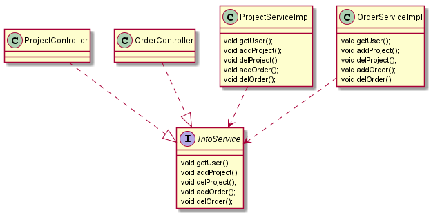

# 七大设计原则
设计原则是程序员在编程时应当遵守的原则，也是各种设计模式的基础（即设计模式为什么这样设计的依据）

- 单一职责原则        
1. 降低类的复杂度，一个类只负责一项职责
2. 提高类的可读性，可维护性
3. 降低变更引起的风险
4. 通常情况下，**我们应当遵守单一职责原则**，只有逻辑足够简单，才可以在代码级违反单一职责原则；如果类中方法数量足够少，可以在方法级别保持单一职责原则

- 接口隔离原则
客户端不应该依赖他不需要的接口，即一个类对另一个类的依赖应该建立在最小的接口上

1. 类A通过接口Interface1依赖类B，类C通过接口Interface1依赖类D,如果接口Interface1对于类A和类C来说不是最小接口，那么类B和类D必须去实现他们不需要的方法。        
A要使用 method1() method2() method3()      
B要使用 method1() method4() method5()      
     
2.按照隔离原则处理：将接口Interface1拆分为独立的几个接口，类A和类C分别与他们需要的接口建立依赖关系        
  
- 依赖倒转原则

- 里氏替换原则

- 开闭原则

- 迪米特法则

- 合成复用原则