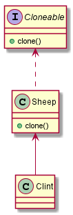

# 原型模式
基本介绍：       
1. 原型模式是指：有一个原型实例（即一个对象），我们 **通过拷贝这个原型实例来创建新的对象**
2. 原型模式是一种创建型模式，允许一个对象在创建另一个可定制对象时，无需知道创建的细节
3. 原理：利用重写 Object 中的 clone() 方法，来完成对象的拷贝    

--- 
克隆羊案例：      
> 有一只羊（Sheep）的类，我们需要3个一样的对象

## 传统方案      
先new出一个对象，然后根据第一个对象的属性来创建其他两个对象     

```
public class Client {
    public static void main(String[] args) {
        Sheep sheep = new Sheep("小红",2,"red");
        Sheep sheep1 = new Sheep(sheep.getName(),sheep.getAge(),sheep.getColor());
        Sheep sheep2 = new Sheep(sheep.getName(),sheep.getAge(),sheep.getColor());

        System.out.println(sheep);
        System.out.println(sheep1);
        System.out.println(sheep2);
    }
}

@Data
@AllArgsConstructor
public class Sheep {
    private String name;
    private int age;
    private String color;
}
```

> 优点：       
1.比较好理解，简单易操作       
缺点：     
1.在创建新对象时，总是需要重新获取原始对象的属性，如果要创建的对象比较复杂，则效率很低        
2.当对象属性值有变化时，总是需要重新初始化对象，而不是动态获得对象运行时的状态，不够灵活      
改进思路：       
Java中 Object 类是所有的类的基类，他提供了一个 clone() 方法，该方法可以将一个 Java 对象复制一份，
但是重写 clone() 方法这个 Java 类必须要实现一个接口 Cloneable ，该接口表示该类能够复制且具有复制的能力——》原型模式

## 使用原型模式        
      

1. 实现 Cloneable 接口
2. 重写 clone() 方法

```puml
public class Client {
    public static void main(String[] args) {
        Sheep sheep = new Sheep("小红",2,"red");
        Sheep sheep1 = new Sheep(sheep.getName(),sheep.getAge(),sheep.getColor());
        Sheep sheep2 = new Sheep(sheep.getName(),sheep.getAge(),sheep.getColor());

        System.out.println(sheep);
        System.out.println(sheep1);
        System.out.println(sheep2);
    }
}

@Data
@AllArgsConstructor
public class Sheep implements Cloneable{
    private String name;
    private int age;
    private String color;

    /**
     * 重写clone
     * @author: HuEnhui
     * @date: 2019/12/22 18:46
     */
    @Override
    protected Object clone(){
        Sheep sheep = null;
        try {
            sheep = (Sheep) super.clone();
        } catch (CloneNotSupportedException e) {
            e.printStackTrace();
        }
        return sheep;
    }
}
```