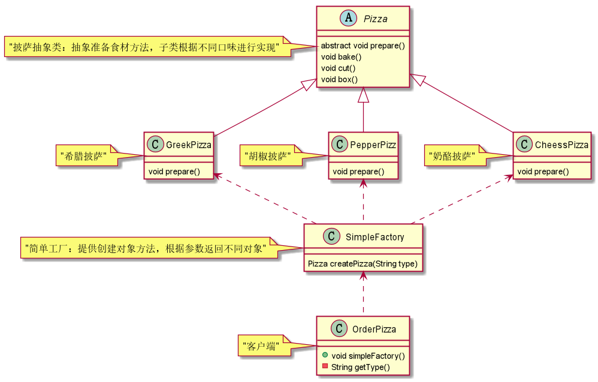

# 工厂模式

## 简单工厂模式
基本介绍：   
1. 简单工厂模式是属于创建型模式，是工厂模式的一种。简单工厂模式是工厂模式家族中最简单实用的模式  
2. 简单工厂模式：定义了一个创建对象的类，这个类来**封装实例化对象的行为（代码）**
3. 在软件开发中，当我们用到大量的创建某种、某类型或者某批对象时，就会使用到工厂模式
4. 简单工厂模式又叫静态工厂模式，两者差别就是 **获取对象的方法是否加了static**

> 看一个需求：     
1.披萨的种类有很多（比如 GreekPizz、CheesePizz 等）       
2.披萨的制作有prepare，bake，cut，box    
3.完成披萨店的订购功能（根据需求创建不同 披萨的对象）

- 不使用设计模式     
        

```puml
/**
 *  下单
 * @author: HuEnhui
 * @date: 2019/12/19 17:04
 */
public class OrderPizza {

	/**
	 * 传统方式获取对象 - 不使用设计模式
	 * @author: HuEnhui
	 * @date: 2019/12/19 17:45
	 */
	public void traditionWay(){
		Pizza pizza = null;
		String orderType; // 订购披萨的类型
		do {
			orderType = getType();
			if (orderType.equals("greek")) {
				pizza = new GreekPizza();
				pizza.setName(" 希腊披萨 ");
			} else if (orderType.equals("cheese")) {
				pizza = new CheesePizza();
				pizza.setName(" 奶酪披萨 ");
			} else if (orderType.equals("pepper")) {
				pizza = new PepperPizza();
				pizza.setName("胡椒披萨");
			} else {
				break;
			}
			//输出pizza 制作过程
			pizza.prepare();
			pizza.bake();
			pizza.cut();
			pizza.box();

		} while (true);
	}

    /**
     * 获取客户输入的披萨种类
     * @author: HuEnhui
     * @date: 2019/12/19 16:55
     */
    private String getType(){
        BufferedReader strin = new BufferedReader(new InputStreamReader(System.in));
        System.out.println("请输入pizza的种类");
        String str = null;
        try {
            str = strin.readLine();
        } catch (IOException e) {
            e.printStackTrace();
            return "";
        }
        return str;
    }
}
```

> 优点：比较好理解，简单易操作        
缺点：违反了开闭原则，当我们要增加新的披萨时，除了要增加披萨类，还要修改所有涉及创建Pizza的代码      
改进思路：把创建Pizza对象封装到一个类中，这样每次新增Pizza种类时，只需要修改该类就可以了--》简单工厂模式

- 简单工厂模式        
 

```puml
/**
 * 简单工厂类
 * @author: HuEnhui
 * @date: 2019/12/19 17:51
 */
public class SimpleFactory {

	/**
	 * 根据下单类型 返回对应的 披萨 对象
	 * @author: HuEnhui
	 * @date: 2019/12/19 17:51
	 */
	public Pizza createPizza(String orderType) {

		Pizza pizza = null;

		System.out.println("使用简单工厂模式");
		if (orderType.equals("greek")) {
			pizza = new GreekPizza();
			pizza.setName(" 希腊披萨 ");
		} else if (orderType.equals("cheese")) {
			pizza = new CheesePizza();
			pizza.setName(" 奶酪披萨 ");
		} else if (orderType.equals("pepper")) {
			pizza = new PepperPizza();
			pizza.setName("胡椒披萨");
		}
		
		return pizza;
	}

	/**
	 *  简单工厂模式 也叫静态工厂模式.
	 * @author: HuEnhui
	 * @date: 2019/12/19 17:53
	 */
	public static Pizza staticCreatePizza(String orderType) {

		Pizza pizza = null;

		System.out.println("使用简单工厂模式");
		if (orderType.equals("greek")) {
			pizza = new GreekPizza();
			pizza.setName(" 希腊披萨 ");
		} else if (orderType.equals("cheese")) {
			pizza = new CheesePizza();
			pizza.setName(" 奶酪披萨 ");
		} else if (orderType.equals("pepper")) {
			pizza = new PepperPizza();
			pizza.setName("胡椒披萨");
		}
		
		return pizza;
	}

}

/**
 *  下单
 * @author: HuEnhui
 * @date: 2019/12/19 17:04
 */
public class OrderPizza {
	/**
	 * 使用简单工厂模式获取对象
	 * @author: HuEnhui
	 * @date: 2019/12/19 18:26
	 */
	public void simpleFactory(SimpleFactory simpleFactory) {
		Pizza pizza = null;
		//用户输入的
		String orderType = "";

		do {
			orderType = getType();
			pizza = simpleFactory.createPizza(orderType);

			//订购成功
			if(pizza != null) {
				pizza.prepare();
				pizza.bake();
				pizza.cut();
				pizza.box();
			} else {
				System.out.println(" 订购披萨失败 ");
				break;
			}
		}while(true);
	}

    /**
     * 获取客户输入的披萨种类
     * @author: HuEnhui
     * @date: 2019/12/19 16:55
     */
    private String getType(){
        BufferedReader strin = new BufferedReader(new InputStreamReader(System.in));
        System.out.println("请输入pizza的种类");
        String str = null;
        try {
            str = strin.readLine();
        } catch (IOException e) {
            e.printStackTrace();
            return "";
        }
        return str;
    }
}

```