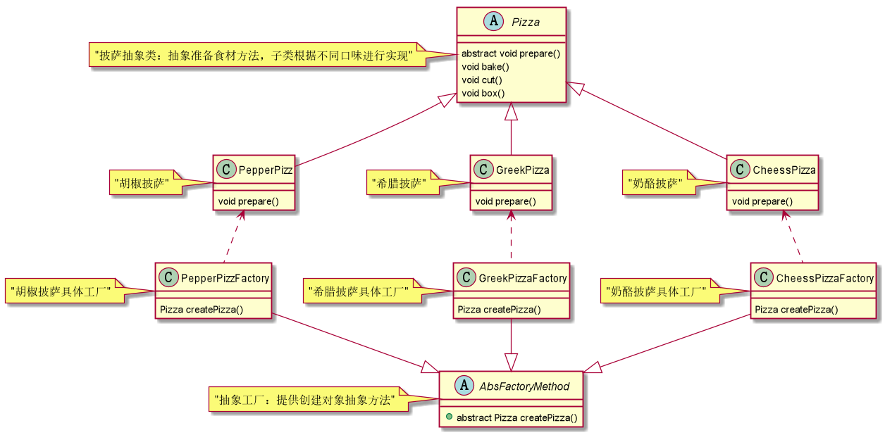
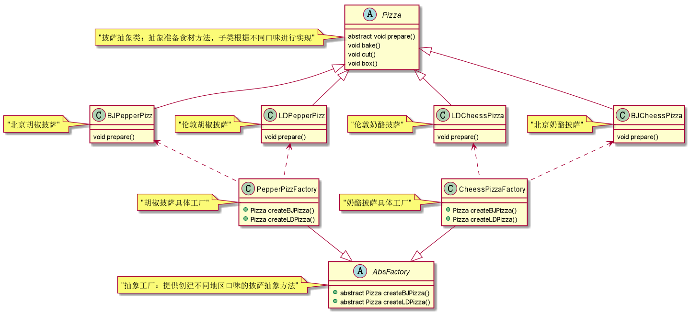

# 工厂模式
我们把被创建的对象称为“产品”，把创建产品的对象称为“工厂”。类的同种类称为同等级
## 简单工厂模式

> 看一个需求：     
1.披萨的种类有很多（比如 GreekPizz、CheesePizz 等）       
2.披萨的制作有prepare，bake，cut，box    
3.完成披萨店的订购功能（根据需求创建不同 披萨的对象）

- 不使用设计模式     
直接在使用的地方创建对象，根据类型创建不同的披萨对象        
        

> 优点：比较好理解，简单易操作        
缺点：违反了开闭原则，当我们要增加新的披萨时，除了要增加披萨类，还要修改所有涉及创建Pizza的代码      
改进思路：把创建Pizza对象封装到一个类中，这样每次新增Pizza种类时，只需要新增pizza类和修改该类就可以了--》简单工厂模式

- 简单工厂模式       
基本介绍：         
1.简单工厂模式是工厂模式家族中最简单实用的模式    
2.简单工厂模式又叫静态工厂模式，两者差别就是 **获取对象的方法是否加了static**

模式的结构：  
1.简单工厂类（Simple Factory）：封装一个创建产品的方法         
2.抽象产品（Product）：定义了产品的规范，描述了产品的主要特性和功能。         
3.具体产品（ConcreteProduct）：实现了抽象产品角色所定义的接口，由简单工厂来创建 
        
        
完整代码地址：https://github.com/Hu-enhui/study-code/tree/master/src/main/java/fun/enhui/design/factory/simplefactory

> 缺点：虽然一定程度上改善了开闭原则，但每次新增披萨种类，还是要修改工厂类      
改进思路：新增一层抽象类（或接口），抽象类只提供必需的方法，对象的创建方法由子类实现，
这样每次新增pizza种类，只需要新增pizza类和新增一个该pizza类的工厂--》工厂方法模式

## 工厂方法模式
基本介绍：       
工厂方法模式，又称工厂模式、多态工厂模式和虚拟构造器模式。       
工厂方法模式中考虑的是一类产品的生产，如畜牧场只养动物、电视机厂只生产电视机、计算机软件学院只培养计算机软件专业的学生等。 

模式的结构：  
1.抽象工厂（Abstract Factory）：提供了创建产品的接口，调用者通过它访问具体工厂的工厂方法 newProduct() 来创建产品。        
2.具体工厂（ConcreteFactory）：主要是实现抽象工厂中的抽象方法，完成具体产品的创建。      
3.抽象产品（Product）：定义了产品的规范，描述了产品的主要特性和功能。     
4.具体产品（ConcreteProduct）：实现了抽象产品角色所定义的接口，由具体工厂来创建，它同具体工厂之间一一对应。

    
完整代码地址：https://github.com/Hu-enhui/study-code/tree/master/src/main/java/fun/enhui/design/factory/factorymethod/

## 抽象工厂模式
基本介绍：    
1.前面介绍的工厂方法模式中考虑的是一类产品的生产，
如畜牧场只养动物、电视机厂只生产电视机、计算机软件学院只培养计算机软件专业的学生等。      
2.同种类称为同等级，也就是说：工厂方法模式只考虑生产同等级的产品     
3.抽象工厂模式是工厂方法模式的升级版本，工厂方法模式只生产一个等级的产品，而抽象工厂模式可生产多个等级的产品。

模式的结构：  
1.抽象工厂（Abstract Factory）：提供了创建产品的接口，它包含多个创建产品的方法 newProduct()，可以创建多个不同等级的产品。        
2.具体工厂（Concrete Factory）：主要是实现抽象工厂中的多个抽象方法，完成具体产品的创建。       
3.抽象产品（Product）：定义了产品的规范，描述了产品的主要特性和功能，抽象工厂模式有多个抽象产品。       
4.具体产品（ConcreteProduct）：实现了抽象产品角色所定义的接口，由具体工厂来创建，它 同具体工厂之间是多对一的关系。      

> 对于新需求：客户在点披萨时，可以点不同地区口味的披萨，比如 北京的奶酪pizza、北京的胡椒pizza或者是伦敦的奶酪pizza、伦敦的胡椒pizza       
此时有多个等级，即地区口味种类（北京、伦敦）和披萨种类（奶酪、胡椒）

 
完整代码地址：https://github.com/Hu-enhui/study-code/tree/master/src/main/java/fun/enhui/design/factory/absfactory/

## JDK中使用工厂模式的案例
- 调用代码

```puml
/** 
 * JDK 中的 Calendar 使用了简单工厂模式 
 * @author: HuEnhui
 * @date: 2019/12/20 14:33  
 */
public class TestJDKCalendar {
    public static void main(String[] args) {
        Calendar calendar = Calendar.getInstance();
    }
    
}
```

- 源码

```puml
public static Calendar getInstance()
{
    // 对于调用方没有指定参数——使用默认的参数
    return createCalendar(TimeZone.getDefault(), Locale.getDefault(Locale.Category.FORMAT));
}

private static Calendar createCalendar(TimeZone zone,
                                           Locale aLocale)
    {
        CalendarProvider provider =
            LocaleProviderAdapter.getAdapter(CalendarProvider.class, aLocale)
                                 .getCalendarProvider();
        if (provider != null) {
            try {
                // 默认方式获取
                return provider.getInstance(zone, aLocale);
            } catch (IllegalArgumentException iae) {
                // fall back to the default instantiation
            }
        }

        Calendar cal = null;

        if (aLocale.hasExtensions()) {
            String caltype = aLocale.getUnicodeLocaleType("ca");
            if (caltype != null) {
                switch (caltype) {
                case "buddhist":
                cal = new BuddhistCalendar(zone, aLocale);
                    break;
                case "japanese":
                    cal = new JapaneseImperialCalendar(zone, aLocale);
                    break;
                case "gregory":
                    cal = new GregorianCalendar(zone, aLocale);
                    break;
                }
            }
        }
        if (cal == null) {
            if (aLocale.getLanguage() == "th" && aLocale.getCountry() == "TH") {
                cal = new BuddhistCalendar(zone, aLocale);
            } else if (aLocale.getVariant() == "JP" && aLocale.getLanguage() == "ja"
                       && aLocale.getCountry() == "JP") {
                cal = new JapaneseImperialCalendar(zone, aLocale);
            } else {
                cal = new GregorianCalendar(zone, aLocale);
            }
        }
        return cal;
    }
```
