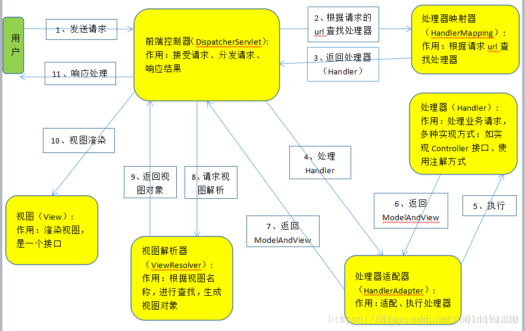

# 适配器模式
>基本介绍：       
1.适配器模式将某个类的接口转换成客户端期望的另一个接口表示，主要目的是兼容性，让原本因接口不匹配不能一起工作的两个类可以协同工作     
2.适配器模式属于结构型模式     
3.主要分为三类：类适配器模式、对象适配器模式、接口适配器模式     

>适配器模式的角色：    
1.目标接口：当前系统业务所期待的接口，它可以是抽象类或接口。   
2.适配者类：它是被访问和适配的现存组件库中的组件接口。    
3.适配器类：它是一个转换器，通过继承或引用适配者的对象，把适配者接口转换成目标接口，让客户按目标接口的格式访问适配者   

> 生活中的案例：你有一个普通安卓的数据线，但手机的插口是TypeC的，
如果你想传输数据或者充电，就需要一个转接口（即适配器）。    
下面例子中，src和dst分别指适配者和目标接口

## 类适配器 
> 插座输出电压为220V            
手机充电需要5V        
使用类适配器，将输出电压由220V转换为5V供手机使用

目标接口：     
```java
/**
 * 目标接口
 *
 * @Author: 胡恩会
 * @Date: 2020/6/26 16:11
 **/
public interface Voltage5V {
    int output5V();
}
```
适配器类：     
```java
/**
 * 适配器类
 *
 * @Author: 胡恩会
 * @Date: 2020/6/26 16:12
 **/
public class VoltageAdapter extends Voltage220V implements Voltage5V {
    @Override
    public int output5V() {
        int srcV = output220V();
        // 转换为 5V
        int dstV = srcV / 40;
        return dstV;
    }
}
```
适配者类：     
```java
/**
 * 适配者
 *
 * @Author: 胡恩会
 * @Date: 2020/6/26 16:12
 **/
public class Voltage220V {
    public int output220V() {
        int src = 220;
        System.out.println("电压= " + src + "伏");
        return src;
    }
}
```
程序入口：     
```java
public class Phone {
    /**
     * 充电
     * @author: HuEnhui
     * @date: 2019/12/23 15:47
     */
    public void charging(Voltage5V voltage5V) {
        if (voltage5V.output5V() == 5) {
            System.out.println("电压为5，充电中");
        }else {
            System.out.println("电压不符，无法充电");
        }
    }
}

public class Client {
    public static void main(String[] args) {
        System.out.println("===类适配器===");
        Phone phone = new Phone();
        phone.charging(new VoltageAdapter());
    }
}
```
      

类适配器模式注意事项和细节：      
1. java是单继承机制，所以类适配器需要继承src类这一点算是一个缺点，因为这要求dst必须是接口，有一定局限性
2. src类的方法在Adapter中都会暴露出来，也增加了使用的成本
3. 由于其继承了src类，所以他可以根据需求重写src类的方法，使得Adapter的灵活性增强了

## 对象适配器模式
1. 基本思路和类的适配器模式相同，只是将Adapter类做修改，不是继承src类，而是持有src类的实例，以解决兼容性的问题。
即：持有src实例，实现dst接口，完成src->dst的适配
2. 根据合成复用原则，在系统中尽量使用关联关系来替代继承关系
3. **对象适配器模式是适配器模式常用的一种**

> 由类适配器案例改造：VoltageAdapter不再继承Voltage220V，将Voltage220V做为成员变量，在构造器中初始化，其余不变

目标接口：    
```java
/**
 * 目标接口
 *
 * @Author: 胡恩会
 * @Date: 2020/6/26 16:16
 **/
public interface Voltage5V {
    int output5V();
}
```
适配器：    
```java
/**
 * 对象适配器
 * @Author: 胡恩会
 * @Date: 2020/6/26 16:16
 **/
public class VoltageAdapter implements Voltage5V {
    Voltage220V voltage220V;
    public VoltageAdapter(Voltage220V voltage220V) {
        this.voltage220V = voltage220V;
    }
    @Override
    public int output5V() {
        int srcV = voltage220V.output220V();
        // 转换为 5V
        int dstV = srcV/40;
        return dstV;
    }
}
```
适配者：    
```java
/**
 * 适配者
 *
 * @Author: 胡恩会
 * @Date: 2020/6/26 16:17
 **/
public class Voltage220V {
    public int output220V() {
        int src = 220;
        System.out.println("电压= " + src + "伏");
        return src;
    }
}
```
程序入口：   
```java
public class Phone {
    /**
     * 充电
     * @author: HuEnhui
     * @date: 2019/12/23 15:47
     */
    public void charging(Voltage5V voltage5V) {
        if (voltage5V.output5V() == 5) {
            System.out.println("电压为5，充电中");
        }else {
            System.out.println("电压不符，无法充电");
        }
    }
}

public class Client {
    public static void main(String[] args) {
        System.out.println("===对象适配器===");
        Phone phone = new Phone();
        VoltageAdapter adapter = new VoltageAdapter(new Voltage220V());
        phone.charging(adapter);
    }
}
```
  
        
## 接口适配器模式
接口适配器模式又叫适配器模式或缺省适配器模式
1. 当不需要全部实现接口提供的方法时，可先设计一个抽象类实现接口，并为该接口中每个方法提供一个默认实现（空方法），
那么该抽象类的子类可有选择地覆盖父类的某些方法来实现需求
2. 适用于一个接口不想使用其所有的方法的情况

    
  
完整代码地址：https://github.com/Hu-enhui/study-code/tree/master/src/main/java/fun/enhui/design/adapter/interfaceadapter/

## SpringMVC中的适配器
- SpringMVC中HandlerAdapter使用的适配器模式
- SpringMVC流程       
 
- 使用HandlerAdapter的原因分析     
可以看到处理器的类型不同，有 **多重实现方式，那么调用方式就不是确定的**，如果需要直接调用Controller方法，
需要调用的时候就得不断使用if else来进行判断是哪一种子类然后执行。如果后期增加Controller，就要不断修改原来的代码，违反了ocp原则

- 手动写SpringMVC通过适配器设计模式获取到对应的Controller的源码      
完整代码地址：https://github.com/Hu-enhui/study-code/tree/master/src/main/java/fun/enhui/design/adapter/springmvc/

说明：         
- Spring定义了一个适配器接口，使得每一种 Controller 有一种对应的适配器实现类
- 适配器代替 Controller 执行相应的方法
- 扩展 Controller 时，只需要增加一个适配器类就完成了 SpringMVC 的扩展了

## 适配器模式的注意事项和细节
1. 三种命名方式，是根据src以怎样的形式给到 Adapter 来命名的
2. 类适配器：在 Adapter 里，将 src 当做类，继承        
对象适配器：在 Adapter 里，将 src 作为一个对象，持有           
接口适配器：在 Adapter 里，将 src 作为一个接口，实现
3. Adapter 模式最大的作用还是将原本不兼容的接口融合在一起工作
4. 实际开发中，实现起来不拘泥于这三种经典形式