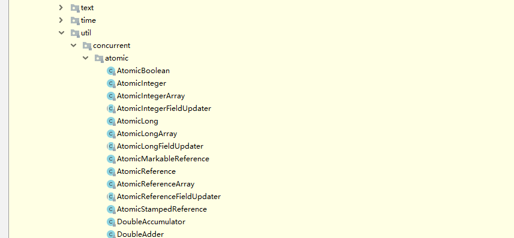

# CAS(Compare And Swap)简介
 > 在计算机科学中，比较和交换（Compare And Swap）是用于实现多线程同步的原子指令。 
 它将内存位置的内容与给定值进行比较，只有在相同的情况下，将该内存位置的内容修改为新的给定值。 
 这是作为单个原子操作完成的。 原子性保证新值基于最新信息计算; 如果该值在同一时间被另一个线程更新，则写入将失败。 
 操作结果必须说明是否进行替换; 这可以通过一个简单的布尔响应（这个变体通常称为比较和设置），或通过返回从内存位置读取的值来完成（摘自维基本科）

**Java1.5开始引入了CAS，主要代码都放在JUC的atomic包下，如下图：**
     
   
# CAS在java.util.concurrent.atomic包下的应用
**以AtomicInteger为例**    
使用AtomicInteger做改值操作++时，调用getAndIncrement方法
``` 
 // 方法在包 package java.util.concurrent.atomic;  类 AtomicInteger
 // 相当于i++
public final int getAndIncrement() {
// 第一个参数是当前对象，第二个参数是内存偏移量，第三个值是修改量
    return unsafe.getAndAddInt(this, valueOffset, 1);
}

// 方法在包 package sun.misc;   类 Unsafe  
public final int getAndAddInt(Object var1, long var2, int var4) {
    int var5;
    do {
        var5 = this.getIntVolatile(var1, var2);
     // var1：当前对象  var2：内存偏移量（内存地址）  var5：当前主物理内存的值   最后一个参数：要修改的值
    } while(!this.compareAndSwapInt(var1, var2, var5, var5 + var4));

    return var5;
}

// 本地方法在包 package sun.misc;  类 Unsafe
public native int getIntVolatile(Object var1, long var2);

// 本地方法在包 package sun.misc;  类 Unsafe  
public final native boolean compareAndSwapInt(Object var1, long var2, int var4, int var5);
```
