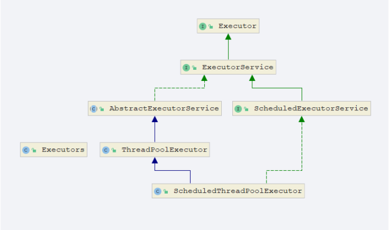

# 线程池

# 线程池的优势
线程池做的工作主要是控制运行的线程的数量,处理过程中将任务加入队列,
然后在线程创建后启动这些任务,如果线程数量超过了最大数量,超出的数量的线程排队等候,
等其他线程执行完毕,再从队列中取出任务来执行.
 
他的主要特点为:，线程复用，控制最大并发数，管理线程.
 
第一:降低资源消耗.通过重复利用已创建的线程降低线程创建和销毁造成的消耗.
第二: 提高响应速度.当任务到达时,任务可以不需要等待线程创建就能立即执行.
第三: 提高线程的可管理性.线程是稀缺资源,如果无限的创建,不仅会消耗资源,
还会降低系统的稳定性,使用线程池可以进行统一分配,调优和监控.

# 线程池的架构
Java中的线程池是通过Executor框架实现的,该框架中用到了Executor,Executors,
ExecutorService,ThreadPoolExecutor这几个类.         
 

# 线程池的使用

代码示例:[三种重点的线程池基本使用](https://github.com/Hu-enhui/study-code/blob/master/src/main/java/fun/enhui/interview/MyThreadPoolDemo.java)
## 了解
-  Executors.newCachedThreadPool();
-  Executors.newWorkStealingPool(int);——java8新增,使用目前机器上可用的处理器作为他的并行级别

## 重点

-  Executors.newFixedThreadPool(int) —— 执行一个长期的任务,性能好很多
>主要特点如下:    
 1.创建一个定长线程池,可控制线程的最大并发数,超出的线程会在队列中等待.  
 2.newFixedThreadPool创建的线程池corePoolSize和MaxmumPoolSize值是相等的,
 它使用的LinkedBlockingQueue        
源码：
```
    public static ExecutorService newFixedThreadPool(int nThreads) {
        return new ThreadPoolExecutor(nThreads, nThreads,
                                      0L, TimeUnit.MILLISECONDS,
                                      new LinkedBlockingQueue<Runnable>());
    }
```

-  Executors.newSingleThreadExecutor() —— 一个任务一个线程执行的任务场景
>主要特点如下:        
1.创建一个单线程化的线程池,它只会用唯一的工作线程来执行任务,保证所有任务都按照指定顺序执行.        
2.newSingleThreadExecutor将corePoolSize和MaxmumPoolSize都设置为1,它使用的LinkedBlockingQueue     
源码：
```
    public static ExecutorService newSingleThreadExecutor() {
        return new FinalizableDelegatedExecutorService
            (new ThreadPoolExecutor(1, 1,
                                    0L, TimeUnit.MILLISECONDS,
                                    new LinkedBlockingQueue<Runnable>()));
    }
```

-  Executors.newCachedThreadPool() —— 适用:执行很多短期异步的小程序或者负载较轻的服务器
> 主要特点如下:       
 1.创建一个可缓存线程池,如果线程池长度超过处理需要,可灵活回收空闲线程,若无可回收,则创建新线程.         
 2.newCachedThreadPool将corePoolSize设置为0，将MaximumPoolSize设置为Integer.MAX_VALUE,
 它使用的是SynchronousQueue,也就是说来了任务就创建线程运行,如果线程空闲超过60秒,就销毁线程      
源码：
```
    public static ExecutorService newCachedThreadPool() {
        return new ThreadPoolExecutor(0, Integer.MAX_VALUE,
                                      60L, TimeUnit.SECONDS,
                                      new SynchronousQueue<Runnable>());
    }
```

# 线程池参数介绍
> 五个参数的构造方法，调用七个参数的构造方法
```
    public ThreadPoolExecutor(int corePoolSize,
                              int maximumPoolSize,
                              long keepAliveTime,
                              TimeUnit unit,
                              BlockingQueue<Runnable> workQueue) {
        this(corePoolSize, maximumPoolSize, keepAliveTime, unit, workQueue,
             Executors.defaultThreadFactory(), defaultHandler);
    }
```        
> 七个参数的构造方法
```
    public ThreadPoolExecutor(int corePoolSize,
                              int maximumPoolSize,
                              long keepAliveTime,
                              TimeUnit unit,
                              BlockingQueue<Runnable> workQueue,
                              ThreadFactory threadFactory,
                              RejectedExecutionHandler handler) {
        if (corePoolSize < 0 ||
            maximumPoolSize <= 0 ||
            maximumPoolSize < corePoolSize ||
            keepAliveTime < 0)
            throw new IllegalArgumentException();
        if (workQueue == null || threadFactory == null || handler == null)
            throw new NullPointerException();
        this.acc = System.getSecurityManager() == null ?
                null :
                AccessController.getContext();
        this.corePoolSize = corePoolSize;
        this.maximumPoolSize = maximumPoolSize;
        this.workQueue = workQueue;
        this.keepAliveTime = unit.toNanos(keepAliveTime);
        this.threadFactory = threadFactory;
        this.handler = handler;
    }
```

1. int corePoolSize:线程池中的常驻核心线程数
>1.在创建了线程池后,当有请求任务来之后,就会安排池中的线程去执行请求任务,近似理解为今日当值线程
 2.当线程池中的线程数目达到corePoolSize后,就会把到达的任务放入到缓存队列当中.
2. int maximumPoolSize:线程池能够容纳同时执行的最大线程数,此值大于等于1

3. long keepAliveTime:多余的空闲线程存活时间,当空闲时间达到keepAliveTime值时,多余的线程会被销毁直到只剩下corePoolSize个线程为止        
>默认情况下:     
 只有当线程池中的线程数大于 corePoolSize 时 keepAliveTime 才会起作用,直到线程中的线程数不大于 corePoolSize,
4. TimeUnit unit:keepAliveTime的单位

5. BlockingQueue<Runnable> workQueue:任务队列,被提交但尚未被执行的任务

6. ThreadFactory threadFactory:表示生成 线程池中工作线程 的线程工厂,用户创建新线程,一般用默认即可

7. RejectedExecutionHandler handler:拒绝策略,表示当线程队列满了并且工作线程大于等于线程池的最大线程数(maximumPoolSize)时如何拒绝.


